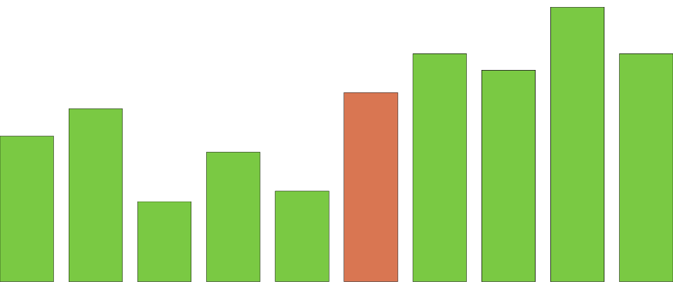

 # Sorting algorithms
 These are some different well-known sorting algorithms, implemented in a few languages
 
 
 ### Currently available algorithms
 - Counting sort
 - Selection sort
 - Quick sort
 
 ### I'm working on
 - Merge sort
 - Insertion sort
 - Radix sort

## Explaination
### Merge sort

Merge sort works by splitting the list in half, and sorting each half. It sorts each half using recursion, so it splits each half in half again and continues until there are only lists of 2 elements. That is the divide. Then it puts each pair of elements in order. That is the conquer part. Then it puts all the small lists together. That is the combine part. 

### Quick sort
Quicksort is one of the most used sorting algorithms because it is simple, and efficient. 

It uses recursion and sorts in place, using a technique known as divide, conquer and combine.

It works by picking an arbitrary pivot point (usually in the middle of the list) and rearranging the other elements so that all the larger elements are on the right of the pivot and all the smaller elements are on the left of the pivot. Then it recursively does this for each side of the pivot, treating each one as a smaller list. Eventually, this will cause the whole list to be in order. 

If you pick the smallest or the largest element as the pivot, then it doesn't work out well. To avoid this, you can pick three elements, and use the median as the pivot of the list, and then you know that at worst, at least one element will be moved. 

### Stability
A sorting method which preserves the relative order of the items with duplicated keys

Stable sorting algorithms can help tremendously with sorting large lists such as social security numbers. Its like different priority sorts on Excel, when you sort by name, and then by surname.

Stable sorting algorithms are usually more efficient, because elements are not swapped unless they have to be.